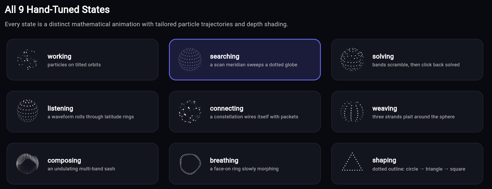

# Agent Thinking Orbs for Flutter

<p align="center">
  
</p>

<p align="center">
  <strong>Dotted thought-orb loading indicators for AI & agent interfaces in Flutter.</strong><br>
  Engineered with high-fidelity 3D particle dynamics and 100% mathematical vector parity.
</p>

<p align="center">
  <a href="https://iansurii.github.io/thinking-orbs-flutter/"></a>
  <a href="https://github.com/ianSurii/thinking-orbs-flutter"></a>
  <a href="https://github.com/ianSurii/thinking-orbs-flutter/actions"></a>
  <a href="https://pub.dev/packages/agent_thinking_orbs"></a>
  <a href="LICENSE"></a>
</p>

---

## Live Web Demo

Test all 9 cognitive states, dark/light themes, custom color tints, sizes, and speed controls in real-time:
[**https://iansurii.github.io/thinking-orbs-flutter/**](https://iansurii.github.io/thinking-orbs-flutter/)

---

## Video Demonstration

Watch the interactive 3D particle dynamics and animations across all 9 cognitive states:

https://github.com/user-attachments/assets/ec0a19c9-83b7-45db-b738-135439b9e0d9

<p align="center">
  <em>Interactive Web Showcase: <a href="https://iansurii.github.io/thinking-orbs-flutter/"><strong>Live Demo</strong></a></em>
</p>

---

## Overview

**Thinking Orbs** are mathematical 3D dot-matrix orb indicators designed specifically for AI reasoning, agent thought processes, and real-time status visualization in Flutter applications.

Each cognitive verb maps directly to a distinct geometric mode:

| State | Geometric Mode | Default Sizes | Description |
|---|---|---|---|
| `OrbState.working` | **Globe** | 64px / 20px | Rotating Fibonacci sphere with latitude oscillation |
| `OrbState.searching` | **Wave** | 64px / 20px | Multi-octave undulating surface wave |
| `OrbState.solving` | **Rubik** | 64px / 20px | Stepped multi-axis cubic layer rotations |
| `OrbState.listening` | **Morph** | 64px / 20px | Harmonic pulsating sphere responding to sound waves |
| `OrbState.connecting` | **Web** | 64px / 20px | Interconnected node network with dynamic lines |
| `OrbState.weaving` | **Braid** | 64px / 20px | Intertwining helical strand geometry |
| `OrbState.composing` | **Ribbon** | 64px / 20px | Flowing Möbius-like topological band |
| `OrbState.breathing` | **Ring** | 64px / 20px | Concentric pulsing toroidal ring |
| `OrbState.shaping` | **Orbits** | 64px / 20px | Multi-inclination planetary orbital rings |

---

## Installation

Add `agent_thinking_orbs` to your `pubspec.yaml`:

```yaml
dependencies:
  agent_thinking_orbs: ^0.1.0
```

Or run:

```bash
flutter pub add agent_thinking_orbs
```

---

## Usage Examples

### 1. Basic Thought Indicator

```dart
import 'package:flutter/material.dart';
import 'package:agent_thinking_orbs/agent_thinking_orbs.dart';

class ThinkingView extends StatelessWidget {
  const ThinkingView({super.key});

  @override
  Widget build(BuildContext context) {
    return const Scaffold(
      body: Center(
        child: ThinkingOrb(
          state: OrbState.working,
          size: OrbSize.large, // 64x64
          theme: OrbTheme.auto, // Automatically reacts to system Dark/Light mode
        ),
      ),
    );
  }
}
```

### 2. Compact Inline Chat Bubble (20px)

Use `ThinkingOrb.small` for compact inline indicators inside conversational chat bubbles or status chips:

```dart
Widget buildAiChatBubble(BuildContext context, String currentStep) {
  return Container(
    padding: const EdgeInsets.symmetric(horizontal: 14, vertical: 10),
    decoration: BoxDecoration(
      color: Theme.of(context).colorScheme.surfaceContainerHighest,
      borderRadius: BorderRadius.circular(16),
    ),
    child: Row(
      mainAxisSize: MainAxisSize.min,
      children: [
        const ThinkingOrb.small(
          state: OrbState.searching,
        ),
        const SizedBox(width: 10),
        Text(
          'Agent is $currentStep...',
          style: const TextStyle(fontSize: 14, fontWeight: FontWeight.w500),
        ),
      ],
    ),
  );
}
```

### 3. Dynamic State Switcher

Seamlessly switch states as your AI agent progresses through different cognitive phases:

```dart
class AgentWorkflowWidget extends StatefulWidget {
  const AgentWorkflowWidget({super.key});

  @override
  State<AgentWorkflowWidget> createState() => _AgentWorkflowWidgetState();
}

class _AgentWorkflowWidgetState extends State<AgentWorkflowWidget> {
  OrbState _currentState = OrbState.searching;

  void _nextStep() {
    setState(() {
      _currentState = switch (_currentState) {
        OrbState.searching => OrbState.solving,
        OrbState.solving => OrbState.composing,
        OrbState.composing => OrbState.working,
        _ => OrbState.searching,
      };
    });
  }

  @override
  Widget build(BuildContext context) {
    return Column(
      mainAxisSize: MainAxisSize.min,
      children: [
        ThinkingOrb(
          state: _currentState,
          size: OrbSize.large,
          speed: 1.2,
        ),
        const SizedBox(height: 16),
        ElevatedButton(
          onPressed: _nextStep,
          child: Text('Current: ${_currentState.name}'),
        ),
      ],
    );
  }
}
```

### 4. Custom Brand Tints & Playback Controls

```dart
// Custom neon-cyan branded orb running at 1.5x speed:
ThinkingOrb(
  state: OrbState.connecting,
  tint: const Color(0xFF00F0FF),
  speed: 1.5,
)

// Paused orb inspecting a specific snapshot:
ThinkingOrb(
  state: OrbState.weaving,
  paused: true,
)
```

---

## API & Properties Reference

| Property | Type | Default | Description |
|---|---|---|---|
| `state` | `OrbState` | **Required** | The cognitive state verb (`working`, `searching`, `solving`, etc.) |
| `size` | `OrbSize` | `OrbSize.large` | `OrbSize.large` (64px) or `OrbSize.small` (20px) |
| `theme` | `OrbTheme` | `OrbTheme.auto` | `OrbTheme.auto` (system dynamic), `OrbTheme.dark`, or `OrbTheme.light` |
| `speed` | `double` | `1.0` | Playback speed multiplier (e.g., `2.0` for 2x speed) |
| `tint` | `Color?` | `null` | Custom dot color tint overriding the default theme palette |
| `paused` | `bool` | `false` | When `true`, freezes the animation at the current timestamp |
| `semanticsLabel` | `String?` | `null` | Accessibility label read by screen readers (e.g. TalkBack / VoiceOver) |

---

## Global Clock Synchronization (`OrbClock`)

When rendering multiple orbs on screen simultaneously (e.g. an agent dashboard), they all synchronize to `OrbClock.shared` by default so their geometric phases remain aligned without frame drift.

```dart
// Freeze all running orbs across the app:
OrbClock.shared.freeze();

// Unfreeze all running orbs:
OrbClock.shared.unfreeze();

// Read the current monotonic timestamp:
final double t = OrbClock.shared.now();
```

---

## Accessibility & Reduced Motion

- **Reduced Motion Support**: Automatically listens to `MediaQuery.disableAnimationsOf(context)`. When the user enables "Reduce Motion" in their OS accessibility settings, `ThinkingOrb` halts the animation ticker and renders a static, beautifully composed frame (`t = 0.60`).
- **Screen Readers**: Encapsulated within a semantic container with descriptive accessibility labels (e.g. `"AI working indicator"`).

---

## Mathematical Parity & Golden Tests

This library includes a **72-case golden test suite** directly comparing Dart engine frame calculations against the vector specification.

All **11,288 dots** and **341 lines** across:
- **9 states** (`working`, `searching`, `solving`, `listening`, `connecting`, `weaving`, `composing`, `breathing`, `shaping`)
- **2 sizes** (`large`, `small`)
- **4 timestamps** (`t = 0.0s`, `t = 0.3s`, `t = 0.6s`, `t = 0.9s`)

pass with numerical error tolerance `< 1e-4`.

---

## License

MIT License &copy; 2026 [Ian Muthuri](https://github.com/ianSurii).

See [LICENSE](LICENSE) for full details.
